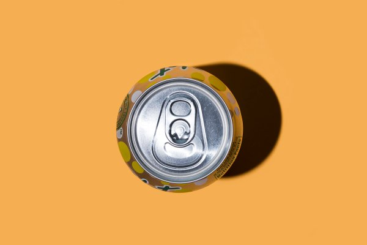
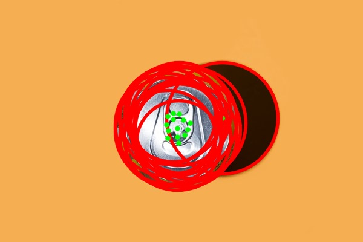

Finding circles in image by using opencv [houghcircles transform](https://docs.opencv.org/2.4/doc/tutorials/imgproc/imgtrans/hough_circle/hough_circle.html).

Circles detected are:
* Minimum radio to be detected is 70.
* Maximum radius to be detected is 100.

|Before: | After: |
| ------------- | ------------- |
|   |   |

